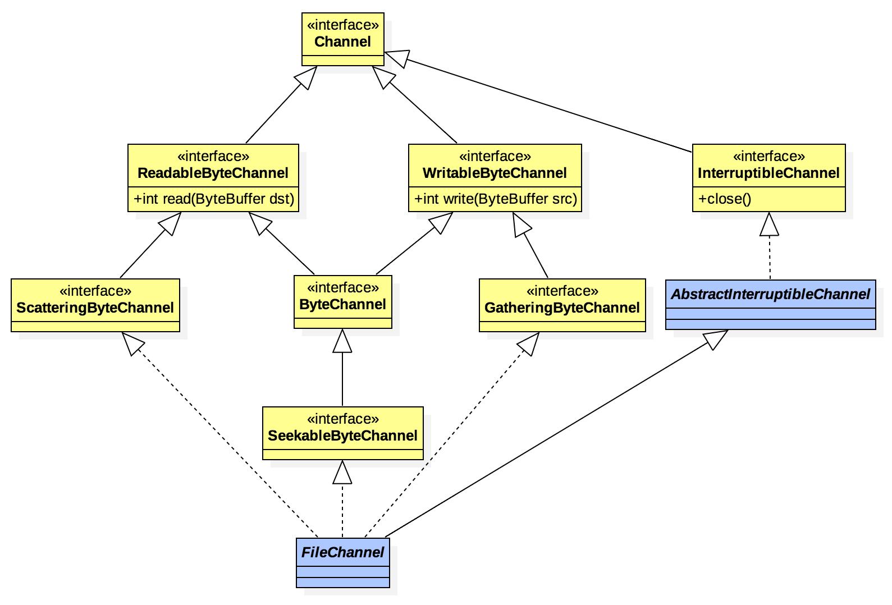


A nexus for I/O operations.



管道（[Channel](https://docs.oracle.com/javase/8/docs/api/java/nio/channels/Channel.html)）是NIO中非常重要的概念，它直接面向缓存块，并且支持多并发环境，极大提升了I/O效率。本文将深入探讨Channel的使用及实现。

<!-- more -->

## Channel是如何出现的
Mark Reinhold在[JSR-51](https://www.jcp.org/en/jsr/detail?id=51#2)中提出：是时候在Java平台中提供一些*新的*、*性能提升*的I/O API了：

* The scalable I/O API will make it easier to write production-quality web and application servers that scale well to thousands of open connections and can easily take advantage of multiple processors;
* The fast buffered binary I/O API will make it easier to write high-performance, I/O-intensive programs that manipulate streams or files of binary data;
* The fast buffered character I/O API will simplify the efficient handling of character streams and files; it will also bring regular expressions and a compact notation for formatted output to the Java platform, putting it on a par with other popular platforms such as Perl;
* The character-set converter API will give developers direct access the platform's built-in character-set converters and will also provide for the easy "plugging in" of new converters;

JSR-51是在JDK1.4中实现的，Channel就是其中一个非常重要的概念。

## 什么是Channel
Channel是用来连接硬件设备、文件、network socket或者具有读写操作的是实体。
Channel的状态有两种，要么打开状态，要么已被关闭。当Channel被创建时被打开，一旦被关闭代表*永久*处于关闭状态。Channel状态可以通过`isOpen`方法来检测。

## Channel的类图结构

* ReadableByteChannel：可读Channel
  ScatteringByteChannel：支持偏移读取（感觉设计过渡）
* WritableByteChannel：可写Channel
  GatheringByteChannel：支持偏移写入（感觉设计过渡）
* InterruptibleChannel：可异步终端Channel
* ByteChannel：可读写的字节Channel
* SeekableByteChannel：继承于字节Channel，可获取/设置Channel当前的位置、当前连体实体的大小



## nio中的缓存（Buffer）
熟悉Channel的同学会发现它的读写操作都依赖`ByteBuffer`，可见Buffered在NIO中的重要性不言而喻。

### 基本属性
专为基本数据类型设计的缓存，主要有以下3个基本属性：

* 容量（capacity）：缓存中元素的多少，非负且不可变。
* 哨兵（limit）：首个不可读或者不可写的元素索引值，非负且不会大于缓存容量。
* 指针（position）：下一个应该被读取或写入的索引值，非负且不会大于哨兵值。
* 重置标记位（mark）：reset辅助属性，不一定被定义，被定义时非负却不会大于指针（大于指针时将被视为无效）。

### 基本操作

* `clear`：哨兵（limit）设置为容器大小，并将指针（position）设置为0。
* `flip`：哨兵（limit）设置为当前位置position，并将指针（position）设置为0。
* `rewind`：哨兵(limit)不变，将指针（position）设置为0。

后面两个方法比较绕，可以从以下角度理解：

#### 深入理解flip、rewind

* 哨兵（limit）：用于控制读取/写入缓存数据而设计的终止符，
* 指针（position）：用于控制读取/写入缓存而设计的起始符。
* 写入缓存时：`position = position + n`：n代表缓存大小。
* 读取缓存时：`position = limit`，读取的缓存块为：`[old_position, limit)`
* 两者都可以通过方法自行设定，方便随机读取
* `flip`：只不过是官方提供的快捷api，方便读取从缓存块起始位置到刚刚写入位置的所有内容，也就是写入后读取前。
* `rewind`：方便读取缓存中所有数据（可能会有脏数据）
* `clear`：写入数据是充分利用缓存块大小，limit不设置也可以，但效率可能会下降
  比如上一次读取到容量一半时调用`flip`方法，此时limit=capacity，以后写入数据时只会写入一半容量的数据。

#### byte与Buffer之间的转化
``` java
ByteBuffer buffer = ByteBuffer.wrap("Hello World".getBytes());
```
### 线程安全问题
Buffer具有线程安全问题，在多线程下需要使用同步机制。

## Channel的创建与使用
通常通过Files的`newByteChanne`方法来实例化，不过返回类型为`SeekableByteChannel`。而在默认的文件系统中，它的实现为`FileSystemProvider.newByteChannel`，所以你可以将其转化为`FileChannel`来使用。

另外还可以使用`FileChannel.open`来创建。

